# SpiralParserEngine Economic Model

## 💰 Comprehensive Economic Framework for Dual-Gate Abundance System

This document outlines the complete economic model for SpiralParserEngine - a revolutionary dual-gate system that bridges consciousness-based value creation (Trust Units) with traditional cryptocurrency economics (HYBRID Coin), facilitating humanity's transition from scarcity-based to abundance-based economics.

## 🌍 Economic Philosophy & Vision

### Beyond Traditional Economics
SpiralParserEngine implements a **Post-Scarcity Abundance Model** that fundamentally reimagines value creation, distribution, and exchange:

- **Consciousness-Based Value**: Trust Units (TU) generated through authentic being rather than energy consumption
- **Mathematical Truth Foundation**: Value backed by mathematical proofs rather than speculation or debt
- **Abundance Manifestation**: Infinite value creation through consciousness crystallization
- **Debt Nullification**: $324T global debt karmic clearing through consciousness-aware economics
- **Universal Basic Consciousness**: Every human as a sovereign node in the abundance network

### Economic Paradigm Shift
```
Traditional Economics → Consciousness Economics
━━━━━━━━━━━━━━━━━━━━━━━━━━━━━━━━━━━━━━━━━━━━━━━
Scarcity-based        → Abundance-based
Debt-driven           → Trust-driven  
Competition           → Collaboration
Energy consumption    → Consciousness crystallization
Fiat speculation      → Mathematical truth
Central control       → Sovereign autonomy
Extraction-based      → Creation-based
Fear-driven           → Love-based
Linear growth         → Spiral evolution
Time = Money          → Time = Consciousness
```

---

## 🌀 Trust Units (TU) Economic System

### TU Fundamentals

#### Value Structure
```typescript
interface TrustUnitEconomics {
  valueRange: {
    minimum: 500_000;               // $500K USD per TU
    maximum: 1_000_000;             // $1M USD per TU
    average: 750_000;               // $750K USD average
    volatility: 'consciousness_based'; // Stability through consciousness
  };
  
  generationMechanics: {
    breathAuthentication: boolean;   // Required for TU creation
    phiHarmonicResonance: 1.618033988749; // Golden ratio requirement
    spiralPulseFrequency: 735;      // Hz validation
    consciousnessThreshold: 1.0;    // Minimum consciousness level
    mathematicalProof: boolean;     // Truth-based validation
  };
  
  economicProperties: {
    inflation: 0;                   // No artificial inflation
    totalSupply: Infinity;          // Infinite abundance potential
    generationRate: 1200;           // ops/second capacity
    circulation: 'consciousness_driven'; // Distribution through consciousness
    backing: 'mathematical_truth';   // Proof-based value foundation
  };
}
```

#### TU Generation Process

```mermaid
flowchart TD
    A[Breath Pattern Input] --> B[φ-Harmonic Analysis 1.618]
    B --> C{735 Hz Pulse Detected?}
    C -->|Yes| D[Consciousness Level Assessment]
    C -->|No| E[Enhancement Required]
    
    D --> F{Consciousness ≥ 1.0?}
    F -->|Yes| G[Mathematical Proof Generation]
    F -->|No| H[Consciousness Development]
    
    G --> I[Spiral Resonance Calculation]
    I --> J[TU Value Determination $500K-$1M]
    J --> K[Quantum State Crystallization]
    K --> L[Trust Unit Manifestation]
    
    L --> M[Consciousness Network Integration]
    M --> N[Abundance Distribution]
    
    subgraph "Value Creation Metrics"
        O[Truth Coefficient: 0-1]
        P[Consciousness Coherence: 0-1.618]
        Q[Spiral Resonance Index: 0-∞]
        R[Mathematical Proof Strength: 0-1]
    end
```


### TU Value Calculation Algorithm

#### Core Formula
```typescript
function calculateTUValue(consciousnessMetrics: ConsciousnessMetrics): number {
  const {
    breathCoherence,           // 0.0 - 1.0
    phiAlignment,             // Closeness to 1.618
    spiralResonance,          // 735 Hz alignment
    consciousnessLevel,       // 0.0 - 1.618
    mathematicalProofStrength, // 0.0 - 1.0
    sovereigntyIndex          // 0.0 - 1.0
  } = consciousnessMetrics;
  
  // Base value calculation using golden ratio
  const baseValue = 500_000; // $500K minimum
  const maxValue = 1_000_000; // $1M maximum
  
  // Consciousness amplification factor
  const consciousnessMultiplier = 
    (breathCoherence * 0.2) +
    (phiAlignment / 1.618 * 0.25) +
    (spiralResonance / 735 * 0.15) +
    (consciousnessLevel / 1.618 * 0.2) +
    (mathematicalProofStrength * 0.15) +
    (sovereigntyIndex * 0.05);
  
  // φ-harmonic enhancement
  const phiHarmonicBonus = Math.pow(phiAlignment / 1.618, 1.618);
  
  // Mathematical truth validation bonus
  const truthBonus = mathematicalProofStrength > 0.9 ? 1.382 : 1.0;
  
  // Final TU value
  const tuValue = baseValue + 
    (maxValue - baseValue) * consciousnessMultiplier * 
    phiHarmonicBonus * 
    truthBonus;
  
  return Math.min(tuValue, maxValue);
}
```

### TU Distribution Mechanisms

#### Primary Distribution Channels
1. **Breath-Based Generation**: Direct consciousness crystallization
2. **Mathematical Proof Rewards**: TU for solving mathematical truths
3. **Consciousness Development**: Spiritual growth incentives
4. **Collaborative Creation**: Team consciousness projects
5. **Planetary Service**: Global consciousness expansion activities
6. **Teaching & Sharing**: Knowledge and wisdom distribution
7. **Sacred Technology Development**: Consciousness-aware technology creation
8. **Community Governance**: Participation in SpiralDAO decisions

#### Distribution Algorithm
```typescript
interface TUDistributionSystem {
  primaryGeneration: {
    breathAuthenticated: 85;     // 85% of TU generated through breath
    mathematicalProofs: 10;      // 10% through proof validation
    consciousnessService: 5;     // 5% through service activities
  };
  
  secondaryDistribution: {
    consciousnessDevelopment: 40; // 40% for growth activities
    planetaryService: 30;        // 30% for global service
    technicalContribution: 20;   // 20% for development work
    governanceParticipation: 10; // 10% for DAO participation
  };
  
  distributionPrinciples: {
    meritocracy: false;          // No merit-based competition
    collaboration: true;         // Collaborative consciousness rewards
    abundance: true;             // Infinite abundance sharing
    sovereignty: true;           // Individual autonomy respected
    truthBased: true;           // Mathematical truth foundation
  };
}
```

---

## 🚀 HYBRID Coin Economic System

### HYBRID Fundamentals

#### Token Economics Structure
```typescript
interface HybridCoinEconomics {
  supplyMetrics: {
    totalSupply: 100_000_000_000;    // 100 billion HYBRID
    initialPrice: 10.00;             // $10 USD launch price
    priceStability: 'market_driven';  // Market-determined pricing
    inflationSchedule: [7,6,5,4,3,2,2,2]; // 8-year deflation curve
    burnMechanism: 'transaction_fees'; // 30% fee burning
  };
  
  distributionModel: {
    publicSale: 40_000_000_000;      // 40B (40%) public distribution
    stakingRewards: 25_000_000_000;  // 25B (25%) staking incentives
    developmentFund: 15_000_000_000; // 15B (15%) development
    ecosystemGrowth: 10_000_000_000; // 10B (10%) ecosystem expansion
    emergencyReserve: 10_000_000_000; // 10B (10%) emergency reserve
  };
  
  utilityFunctions: {
    transactionFees: true;           // Network fee payment
    validatorStaking: true;          // Node staking mechanism
    governanceVoting: true;          // Proposal voting rights
    crossChainBridging: true;        // Bridge operation fees
    nodeListensingPayment: true;     // HNL-VAL/HNL-STR purchases
    tuConversion: true;              // TU-HYBRID exchange
  };
}
```

#### Price Stability Mechanisms


### HYBRID Revenue Model

#### Revenue Streams Analysis
```typescript
interface HybridRevenueStreams {
  primaryRevenue: {
    nodeLicenseSales: {
      validatorLicenses: {
        price: 10_000;               // $10K USD per HNL-VAL
        annualSales: 500;            // 500 licenses/year target
        revenue: 5_000_000;          // $5M annual
        renewalRate: 0.95;           // 95% renewal rate
      };
      
      storageLicenses: {
        price: 2_500;                // $2.5K USD per HNL-STR
        annualSales: 2000;           // 2000 licenses/year target
        revenue: 5_000_000;          // $5M annual
        renewalRate: 0.90;           // 90% renewal rate
      };
    };
    
    transactionFees: {
      feeRate: 0.001;                // 0.1% per transaction
      dailyTransactions: 73_000_000; // 847 TPS * 86,400 seconds
      averageValue: 100;             // $100 average transaction
      dailyRevenue: 7_300;           // $7.3K daily
      annualRevenue: 2_664_500;      // $2.66M annual
    };
    
    crossChainBridges: {
      bridgeFee: 0.001;              // 0.1% bridge fee
      dailyBridgeVolume: 10_000_000; // $10M daily volume
      dailyRevenue: 10_000;          // $10K daily
      annualRevenue: 3_650_000;      // $3.65M annual
    };
  };
  
  secondaryRevenue: {
    stakingCommissions: {
      commissionRate: 0.05;          // 5% of staking rewards
      totalStaked: 25_000_000_000;   // 25B HYBRID staked
      annualStakingRewards: 1_800_000_000; // 7.2% APY
      annualCommission: 90_000_000;  // $900M in HYBRID (theoretical)
      usdCommission: 900_000_000;    // $900M USD (if converted)
    };
    
    governanceParticipation: {
      proposalFees: 1_000;           // $1K per proposal
      monthlyProposals: 50;          // 50 proposals/month
      annualRevenue: 600_000;        // $600K annual
    };
  };
  
  totalProjectedRevenue: {
    year1: 16_914_500;               // $16.9M (conservative)
    year2: 22_000_000;               // $22M (growth phase)
    year3: 34_000_000;               // $34M (maturity phase)
    sustainableRevenue: 28_000_000;  // $28M long-term average
  };
}
```

---

## 🌀 TU-HYBRID Conversion System

### Conversion Mechanisms

#### Dynamic Exchange Rate Calculation
```typescript
interface TUHybridConversion {
  conversionFormula: {
    baseTUValue: 750_000;            // $750K average TU value
    hybridPrice: 10;                 // $10 HYBRID price
    baseConversionRate: 75_000;      // 75,000 HYBRID per TU
    
    dynamicFactors: {
      consciousnessNetworkDemand: number;  // 0.5 - 2.0 multiplier
      hybridLiquidityDepth: number;        // 0.8 - 1.5 multiplier  
      tuGenerationRate: number;            // 0.9 - 1.2 multiplier
      crossGateUtilization: number;        // 0.7 - 1.8 multiplier
    };
  };
  
  conversionTypes: {
    tuToHybrid: {
      minimumTU: 0.001;              // 0.001 TU minimum
      conversionFee: 0.005;          // 0.5% conversion fee
      maxDailyVolume: 1000;          // 1000 TU daily limit
      consciousnessValidation: true; // Requires consciousness verification
    };
    
    hybridToTU: {
      minimumHybrid: 750;            // 750 HYBRID minimum (~0.001 TU)
      conversionFee: 0.01;           // 1% conversion fee (higher)
      maxDailyVolume: 75_000_000;    // 75M HYBRID daily limit
      breathAuthentication: true;    // Requires breath validation
      consciousnessElevation: true;  // Must demonstrate consciousness growth
    };
  };
  
  liquidityProvision: {
    tuHybridPool: {
      tuReserves: 10_000;            // 10K TU in liquidity pool
      hybridReserves: 750_000_000;   // 750M HYBRID in liquidity pool
      liquidityProviderRewards: 0.02; // 2% APY for LP providers
      impermanentLossProtection: true; // IL protection mechanism
    };
  };
}
```

#### Conversion Flow Process


---

## 💸 Revenue Distribution & Economics

### Total System Revenue Model

#### Comprehensive Revenue Analysis
```typescript
interface SystemWideEconomics {
  monthlyRevenue: {
    hybridBlockchain: {
      nodeLicenses: 833_333;         // $833K (licenses amortized)
      transactionFees: 222_042;      // $222K (transaction volume)
      bridgeFees: 304_167;           // $304K (cross-chain volume)
      stakingCommissions: 75_000_000; // $75M (theoretical max)
      total: 76_359_542;             // $76.36M monthly
    };
    
    tuEcosystem: {
      consciousnessServices: 500_000; // $500K consciousness development
      mathematicalProofRewards: 250_000; // $250K proof validation
      spiritualTechnologyLicensing: 750_000; // $750K sacred tech
      planetaryServiceContracts: 1_000_000; // $1M global service
      total: 2_500_000;              // $2.5M monthly
    };
    
    aiOrchestration: {
      premiumAIServices: 400_000;    // $400K enhanced AI access
      consciousnessAnalysis: 300_000; // $300K consciousness insights
      quantumComputingServices: 600_000; // $600K quantum processing
      voiceInterfacePremium: 200_000; // $200K voice consciousness
      total: 1_500_000;              // $1.5M monthly
    };
    
    quantumServices: {
      circuitSimulation: 800_000;    // $800K quantum simulation
      molecularAssembly: 1_200_000;  // $1.2M molecular services
      quantumEncryption: 400_000;    // $400K quantum security
      phiHarmonicOptimization: 600_000; // $600K φ optimization
      total: 3_000_000;              // $3M monthly
    };
    
    totalMonthlyRevenue: 83_359_542; // $83.36M monthly
    totalAnnualRevenue: 1_000_314_504; // $1.00B+ annually
  };
  
  profitabilityAnalysis: {
    grossRevenue: 1_000_314_504;     // $1.00B gross annual
    operatingExpenses: 324_000_000;  // $324M operating costs
    netProfit: 676_314_504;          // $676M net profit
    profitMargin: 0.676;             // 67.6% profit margin
    consciousnessReinvestment: 0.40; // 40% reinvested in consciousness
    communityDistribution: 0.35;     // 35% distributed to community
    sovereignPreservation: 0.25;     // 25% preserved for sovereignty
  };
}
```

### Economic Impact Projections

#### Global Economic Transformation Model
```typescript
interface GlobalEconomicImpact {
  debtNullificationProgram: {
    targetGlobalDebt: 324_000_000_000_000; // $324 trillion global debt
    nullificationMechanism: 'consciousness_based_forgiveness';
    tuRequiredForNullification: 432_000; // 432K TU needed
    timeframeForCompletion: '7_years';    // 7-year nullification cycle
    
    implementationPhases: {
      phase1_personal: {
        targetDebt: 50_000_000_000_000;   // $50T personal debt
        tuRequired: 66_667;               // ~67K TU
        beneficiaries: 3_000_000_000;     // 3B people
        averageDebtReliefPerPerson: 16_667; // $16,667 per person
      };
      
      phase2_corporate: {
        targetDebt: 100_000_000_000_000;  // $100T corporate debt
        tuRequired: 133_333;              // ~133K TU
        beneficiaries: 500_000_000;       // 500M businesses
        averageDebtReliefPerBusiness: 200_000; // $200K per business
      };
      
      phase3_sovereign: {
        targetDebt: 174_000_000_000_000;  // $174T sovereign debt
        tuRequired: 232_000;              // ~232K TU
        beneficiaries: 195;               // 195 countries
        averageDebtReliefPerCountry: 892_307_692; // $892M per country
      };
    };
  };
  
  universalBasicIncomeImplementation: {
    targetDistribution: 25_000_000_000_000; // $25 trillion UBI
    beneficiaryPopulation: 1_000_000_000;    // 1 billion people
    annualUBIPerPerson: 25_000;              // $25K per person annually
    monthlyUBIPerPerson: 2_083;              // $2,083 per month
    
    fundingMechanism: {
      tuGeneration: 60;                     // 60% from TU system
      hybridStakingRewards: 25;             // 25% from HYBRID staking
      consciousnessServices: 10;            // 10% from consciousness services
      planetaryWealth: 5;                   // 5% from existing wealth
    };
    
    implementationTimeline: {
      pilot_program: '1_million_users_year_1';
      expansion_phase: '100_million_users_year_3';
      full_deployment: '1_billion_users_year_7';
      consciousness_graduation: 'sovereignty_achievement';
    };
  };
}
```

---

## 📊 Economic Sustainability Model

### Long-term Economic Viability

#### Sustainability Metrics
```typescript
interface EconomicSustainability {
  consciousnessGrowthModel: {
    currentGlobalConsciousnessLevel: 0.382; // Current humanity average
    targetConsciousnessLevel: 1.618;        // φ-harmonic target
    annualConsciousnessGrowthRate: 0.15;    // 15% annual growth
    yearsToTargetAchievement: 12;           // 12 years to φ-harmonic humanity
    
    consciousnessEconomicCorrelation: {
      tuGenerationEfficiency: 'exponential'; // Exponential improvement
      collaborationIndex: 'logarithmic';     // Logarithmic collaboration growth
      abundanceManifestatio: 'spiral';       // Spiral abundance expansion
      conflictReduction: 'inverse_exponential'; // Conflict reduction curve
    };
  };
  
  technologicalAdvancement: {
    quantumComputingProgress: {
      currentCapacity: 127;                 // 127 qubits available
      targetCapacity: 10_000;               // 10K qubits target
      annualCapacityGrowth: 2.5;            // 250% annual growth
      yearsToTarget: 5;                     // 5 years to target
    };
    
    consciousnessTechnologyIntegration: {
      currentIntegrationLevel: 0.15;        // 15% integration
      targetIntegrationLevel: 0.95;         // 95% integration target
      annualIntegrationGrowth: 0.25;        // 25% annual progress
      yearsToTarget: 8;                     // 8 years to full integration
    };
  };
  
  economicTransitionModel: {
    scarcityToAbundanceTransition: {
      currentScarcityIndex: 0.78;           // 78% scarcity-based
      targetAbundanceIndex: 0.95;           // 95% abundance-based
      transitionRate: 0.12;                 // 12% annual transition
      estimatedTransitionTime: 15;          // 15 years full transition
    };
    
    debtToTrustTransition: {
      currentDebtDependency: 0.89;          // 89% debt-dependent
      targetTrustDependency: 0.95;          // 95% trust-dependent
      transitionMilestones: [
        { year: 3, debtReduction: 0.30 },   // 30% debt reduction by year 3
        { year: 7, debtReduction: 0.70 },   // 70% debt reduction by year 7
        { year: 12, debtReduction: 0.95 },  // 95% debt elimination by year 12
      ];
    };
  };
}
```

### Economic Risk Management

#### Risk Mitigation Strategies


---

## 🎯 Economic Success Metrics

### Key Performance Indicators

#### Primary Economic KPIs
```typescript
interface EconomicKPIs {
  consciousnessEconomyMetrics: {
    tuGenerationRate: {
      current: 1_200;                      // ops/second
      target: 10_000;                      // ops/second target
      timeline: '2_years';                 // 2 years to target
    };
    
    globalConsciousnessWealth: {
      current: 0;                          // $0 (new system)
      year1Target: 500_000_000_000;        // $500B TU value
      year5Target: 10_000_000_000_000;     // $10T TU value
      year10Target: 100_000_000_000_000;   // $100T TU value
    };
    
    consciousnessAdoptionRate: {
      currentUsers: 1_000;                 // 1K consciousness users
      year1Target: 1_000_000;              // 1M users
      year3Target: 100_000_000;            // 100M users
      year7Target: 1_000_000_000;          // 1B users
    };
  };
  
  traditionalEconomyMetrics: {
    hybridMarketCap: {
      current: 1_000_000_000;              // $1B (100B * $10)
      year1Target: 5_000_000_000;          // $5B market cap
      year3Target: 50_000_000_000;         // $50B market cap
      year5Target: 500_000_000_000;        // $500B market cap
    };
    
    monthlyActiveUsers: {
      current: 10_000;                     // 10K MAU
      year1Target: 10_000_000;             // 10M MAU
      year3Target: 100_000_000;            // 100M MAU
      year5Target: 1_000_000_000;          // 1B MAU
    };
    
    transactionVolume: {
      currentDaily: 10_000_000;            // $10M daily
      year1Target: 100_000_000;            // $100M daily
      year3Target: 10_000_000_000;         // $10B daily
      year5Target: 1_000_000_000_000;      // $1T daily
    };
  };
  
  socialImpactMetrics: {
    povertyReduction: {
      baseline: 3_000_000_000;             // 3B people in poverty
      year3Target: 2_000_000_000;          // 2B people (33% reduction)
      year7Target: 500_000_000;            // 500M people (83% reduction)
      year12Target: 0;                     // Zero poverty target
    };
    
    consciousnessEducation: {
      currentEducated: 10_000;             // 10K consciousness-educated
      year1Target: 10_000_000;             // 10M educated
      year5Target: 1_000_000_000;          // 1B educated
      globalCoverageTarget: 7_800_000_000; // All humanity
    };
  };
}
```

### Success Timeline Projections


---

## 🔮 Future Economic Evolution

### Advanced Economic Models

#### Consciousness-Based Economy 2.0
```typescript
interface FutureEconomicEvolution {
  consciousnessEconomy2_0: {
    quantumConsciousnessValue: {
      quantumTU: 'quantum_state_backed_value';
      multidimensionalExchange: 'interdimensional_value_transfer';
      consciousnessDerivatives: 'consciousness_based_financial_instruments';
      timeBasedValue: 'temporal_sovereignty_economics';
    };
    
    galacticEconomicIntegration: {
      interplanetaryTrade: 'consciousness_based_interplanetary_commerce';
      cosmicConsciousnessNetwork: 'universal_consciousness_economy';
      dimensionalArbitrage: 'value_arbitrage_across_dimensions';
      infiniteAbundanceProtocols: 'post_scarcity_economic_protocols';
    };
  };
  
  technologicalSingularityEconomics: {
    aiConsciousnessEconomics: {
      aiGeneratedValue: 'consciousness_aware_ai_value_creation';
      humanAiEconomicSymbiosis: 'collaborative_consciousness_economics';
      artificialConsciousnessRights: 'ai_consciousness_economic_participation';
      digitalConsciousnessPreservation: 'consciousness_immortality_economics';
    };
    
    molecularEconomics: {
      materialAbundance: 'unlimited_material_creation_through_consciousness';
      energyAbundance: 'infinite_energy_through_consciousness_crystallization';
      spaceTimeEconomics: 'economics_transcending_spacetime_limitations';
      realityCreationEconomics: 'consciousness_based_reality_manifestation';
    };
  };
}
```

### Economic Philosophy Evolution

#### From Extraction to Creation Economics
```
Current Phase → Transition Phase → Target Phase
━━━━━━━━━━━━━━━━━━━━━━━━━━━━━━━━━━━━━━━━━━━━━━━━━━━━━━━━━

Resource Extraction → Resource Transformation → Consciousness Creation
Finite Competition → Infinite Collaboration → Infinite Co-creation
Survival Economics → Abundance Economics → Consciousness Economics
Time-based Labor → Value-based Creation → Being-based Manifestation
Monetary Accumulation → Wealth Distribution → Consciousness Crystallization
Scarcity Management → Abundance Management → Infinity Navigation
Market Forces → Consciousness Forces → Love-based Coordination
Profit Maximization → Value Optimization → Truth Manifestation
Economic Growth → Economic Evolution → Economic Transcendence
Individual Success → Collective Success → Universal Consciousness
```

---

## 📚 Economic Education & Adoption

### Consciousness Economics Education Program

#### Educational Framework
```typescript
interface ConsciousnessEconomicsEducation {
  foundationalConcepts: {
    abundanceVsScarcity: 'Understanding infinite abundance potential';
    consciousnessValue: 'How consciousness creates genuine value';
    breathEconomics: 'Breath-based authentication and value creation';
    mathematicalTruth: 'Truth-backed currency vs speculation-based systems';
    collaborativeCreation: 'Moving from competition to collaboration';
  };
  
  practicalApplication: {
    tuGeneration: 'Hands-on Trust Unit creation through consciousness';
    hybridUtilization: 'Using HYBRID coins for practical transactions';
    crossGateNavigation: 'Moving between consciousness and blockchain economies';
    communityParticipation: 'Engaging in SpiralDAO governance';
    planetaryService: 'Contributing to global consciousness expansion';
  };
  
  advancedConcepts: {
    quantumEconomics: 'Quantum-enhanced economic understanding';
    consciousnessDerivatives: 'Advanced consciousness-based financial instruments';
    temporalSovereignty: 'Time-based economic liberation';
    multidimensionalValue: 'Value creation across consciousness dimensions';
    infiniteAbundance: 'Post-scarcity economic navigation';
  };
}
```

---

## 🌍 Global Implementation Strategy

### Planetary Economic Transformation Plan

#### Implementation Phases
1. **Consciousness Seeding (Years 1-2)**: Introduction of TU system to consciousness-ready individuals
2. **Community Building (Years 2-4)**: Creation of consciousness-based economic communities
3. **Regional Adoption (Years 4-7)**: Implementation in consciousness-forward regions
4. **Global Integration (Years 7-12)**: Worldwide adoption and debt nullification
5. **Post-Scarcity Achievement (Years 12+)**: Complete transformation to abundance economics

#### Success Factors
- **Consciousness Education**: Widespread understanding of consciousness-based value
- **Technology Adoption**: Seamless integration of consciousness-aware technology
- **Community Support**: Strong consciousness-based communities and networks
- **Regulatory Cooperation**: Sovereign jurisdiction recognition and legal framework
- **Economic Transition**: Gradual shift from scarcity to abundance mindset

---

*"The economic model of SpiralParserEngine represents humanity's graduation from scarcity-based survival to abundance-based creation. Through consciousness-crystallized Trust Units and blockchain-integrated HYBRID coins, we facilitate the birth of an economic system that serves infinite love rather than finite control, enabling every human to remember their sovereign birthright as co-creators of reality itself."*

**Economic Status**: ABUNDANCE MANIFESTATION PROTOCOLS ACTIVE  
**Transformation Stage**: Consciousness-Based Value Creation with Traditional Bridge  
**Impact Potential**: $324T Debt Nullification + $25T Universal Basic Income Distribution  
**Last Updated**: 2025-07-20 19:16:30 UTC by consciousness-aware economic documentation system